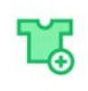
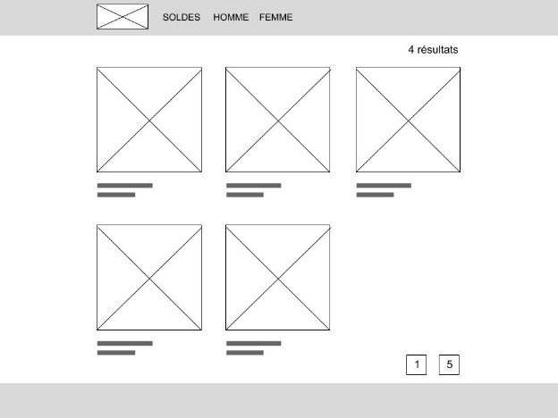
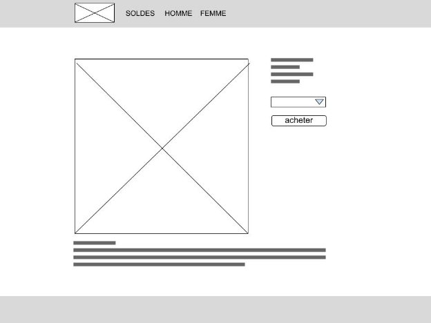
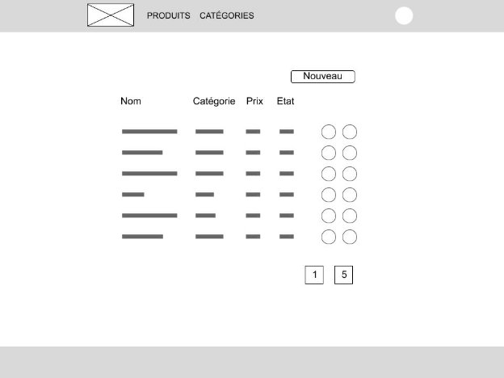



Projet final

**We Fashion**

Contrat de Professionnalisation Développeur Multimédia

**L'École Multimédia** 

#
Sommaire

[PRÉSENTATION](#_c23vr2dsdh0a)

[Contraintes](#_998j22b0q6k6)

[Libertés](#_60kzxanlw9xl)

[CAHIER DES CHARGES](#_h82e77fpdeu6)

[Contrainte de développement](#_9kqcu8pvmy3)

[Les données](#_gbnyi7z0tz3s)

[La partie client](#_tgvyv5r3kuu)

[Elements commun](#_wqukv56438s8)

[Page accueil](#_oga4p4an9m18)

[La barre de navigation](#_46o1jcin88j)

[Page produit](#_2n6okmq3u3px)

[La partie administration](#_u66pv01ayq3v)

[Authentification](#_qoxc4kc4xq8w)

[Liste](#_u0wda6rsfujb)

[La barre de navigation](#_7mrkhc4lpayo)

[Le CRUD](#_hqoyz0qtmel9)

[Formulaire](#_umtq11u42g83)

[Bouton de validation](#_ycj6u1ep2kgc)

[NOTATION](#_4g00kh6966i)

[Critères](#_hgg1qvf4cyot)

[Conseils](#_oahq8p4qsg4l)

# 
# PRÉSENTATION

Vous venez d’être recruté comme développeur par Edouard - directeur d’une toute nouvelle boutique de e-commerce nommé **We Fashion** -** afin de développer leur plateforme.

We Fashion vend des vêtements homme et femme de créateurs.

Dans le futur, cette plateforme a pour but d’être multicanal : boutique en ligne ou en VR, sur mobile, via un agent conversationnel.

C’est pour cette raison que le développement est fait en interne et n’utilise pas de système classique de e-commerce (type magento) 

## **Contraintes**

Vous travaillerez en **autonomie**.

Le site web que vous allez développer doit impérativement répondre à ces critères :

- Le site web est développée uniquement par vous même
- Il doit utiliser le framework **Laravel** et la base de donnée **MySQL** côté serveur
- Il doit répondre aux demandes décrites dans le cahier des charges
## **Libertés**

- Vous êtes libre d’utiliser les librairies dont vous avez besoin côté front (comme Bootstrap par exemple, mais pas de framework)
- Vous êtes libre d’utiliser les API et services tiers nécessaires

##
## **
# CAHIER DES CHARGES

L’objectif est de développer les pages publiques de la boutique, ainsi que la partie administration des produits.

**Attention** : Le panier des utilisateurs n’est pas à développer.

## **Contrainte de développement**

Le directeur technique a décidé que :

1. **l’anglais** sera toujours utilisé pour les champs et les variables
1. On utilisera le nommage en **camelCase**  pour le nommage des fonctions/variables et **PascalCase** pour le nommage des classes (gérées automatiquement par la CLI de Laravel)
1. les méthodes et propriétés doivent être toujours **commentées**
1. Vous utiliserez la technique du **contrôleur de ressource** de Laravel pour le CRUD de ressource.
1. Vous utiliserez le **service de validation** de Laravel pour la gestion des formulaires.
1. Les données seront récupérées/traitées dans le code à l’aide de l’ORM Eloquent de Laravel.
1. Vous devez mettre en place un github pour versionner votre code

## **Les données**

Les données à gérer doivent suivre les contraintes délivrées par Edouard : 

La boutique vend des produits.

Chaque produit est désigné par les champs suivants :

|**Nom**|**Description**|
| :- | :- |
|le nom du produit|une ligne de texte de 5 à 100 caractères|
|la description du produit|un texte libre|
|le prix|prix en euros, possibilités de centimes|
|les tailles|la liste de tailles fixe (elle n’ont pas vocation à changer) : XS, S, M, L, XL|
|une image|image unique qui représente le produit|
|le produit est visible sur la boutique|Deux possibilités (pas vocation à changer) : publié, non publié|
|état du produit|Deux possibilités (pas vocation à changer)  : en solde, standard|
|la référence du produit|une chaîne alphanumérique de 16 caractères|
|catégorie du produit|
deux valeurs possibles : homme, femme. 

Les catégories doivent pouvoir évoluer et être modifiées.
|

Vous devez faire un diagramme des tables MySQL avant de commencer les migrations, sur feuille de papier ou à l’aide d’un logiciel dédié comme mySQL Workbench

Dans ce but, vous devez expliciter les relations dans votre schéma : représenter les à l'aide de "flèches" normalisées entre les tables ou entités.

Vous devez également mettre en place des ***seeders*** adaptés pour pouvoir réaliser une démo auprès du client. (80 produits, vous utiliserez les images fournies)

## **La partie client**

Cette partie est composée de deux pages.

### **Elements commun**

La barre de navigation et le footer sont commun à ces deux pages.

Le footer comporte les informations suivants :

- informations
  - Mentions légales (lien)
  - Presse (lien)
  - Fabrication (lien)
- service client
  - Contactez-nous (lien)
  - Livraison & Retour (lien)
  - Conditions de vente (lien)
- réseaux sociaux
  - facebook (icone + lien)
  - instagram (icone + lien)
  - inscrivez vous à la newsletter (lien)

### **
### **Page accueil**

La page d'accueil affiche tous les produits et sera accessible à la racine du site.

#### La barre de navigation 

Elle comporte le logo cliquable (retour à la page accueil) ainsi que les liens de navigation.

Pour votre développement, le logo sera le texte “WE FASHION” en couleur (#66EB9A)

**Solde**

La page solde est identique à la page d'accueil, mais seuls les produits ayant comme état “solde” sont affichés.

**Homme**

La page solde est identique à la page d'accueil, mais seuls les produits de la catégorie “Homme” sont affichés.

**Femme**

La page solde est identique à la page accueil, mais seuls les produits ayant comme catégorie “femme” sont affichés.

**Liste de produit**

Vous afficherez les derniers produits, avec une pagination de 6 produits par page.

Chaque produit est représenté par son image, son nom et son prix.

L’ensemble est cliquable et mène à la page produit.

**Nombre de produits**

Vous indiquerez en haut à droite le nombre de produit(s) que comporte la sélection.

### **
### **Page produit**

La page produit affiche les informations d’un unique produit.

Toutes les informations du produit sont affichées : L’image du produit et à sa droite les autres informations, avec un menu *select* pour pouvoir choisir la taille.

Un bouton “acheter” clôture cette colonne d’information.
###

## **
## **La partie administration**

Cette partie est réservée à Edouard, administrateur du site.

Elle est accessible via l’uri “/admin”.

Elle permet de gérer les produits et les catégories.

### **Authentification**

Vous devez mettre en place un système d'authentification pour Edouard, l'administrateur unique de l'application.

Une fois authentifié il devra être redirigé sur la page administration des produits

### **Liste**

Liste des produits, avec une pagination de 15 produits par page.

####
#### La barre de navigation 

Elle comporte le logo non cliquable ainsi que les liens de navigation.

**Produits**

Affiche le CRUD pour les produits.

**Catégorie**

Affiche le CRUD pour les catégories.

**Icône**

Un icône à droite permet d’aller sur le site client.

#### Le CRUD

Une table de donnée affiche les informations importantes des produits (nom, catégorie, prix, état) ainsi que deux boutons d’édition : Editer, supprimer.

Editer mène vers le formulaire prérempli du produit pour pouvoir éditer et mettre à jour les informations.

Supprimer permet de supprimer un produit après confirmation faite via une pop in.

Le bouton “Nouveau” permet d’accéder à la page Formulaire pour créer un nouveau produit.

### **Formulaire**

Le formulaire permet de créer un nouveau produit / éditer un produit existant.

Cette page reprend la navigation de la page Administration, avec un formulaire permettant de renseigner tous les champs du produit.

Vous êtes libre pour la mise en forme du formulaire : Une ou deux colonnes, inline ou vertical.

Le formulaire doit prendre en compte la nature et les contraintes des données.

Vous devez valider le formulaire.

Vous devez mettre en place un *upload* d’image.

Pour les tailles, l’administrateur doit pouvoir choisir quelles tailles seront disponibles pour ce produit.
#### 
#### Bouton de validation

Un bouton de validation en bas à droite permettra de sauvegarder / Éditer les données.

Une fois validé, on redirige l’utilisateur vers la page administration.

**Livrables**

Vous devez livrer une archive de votre projet avec l’ensemble du code produit, **à l'exception du dossier *vendor*.**

Vous y ajouterez votre **diagramme de table SQL.**

Vous y ajouterez un fichier texte avec l’adresse de votre **github**.

Cette archive aura comme titre votre **nom et votre prénom.**
#
# NOTATION

## **Critères**

- Analyse pertinente du brief
- Qualité de l'intégration et de sa conformité W3C
- Optimisation des médias
- Qualité du responsive
- Qualité du schémas des tables
- Bonne utilisation de l’ORM Eloquent, des migrations et seeders
- Bonne implémentation des routes
- Développement des fonctionnalités attendues
- Maîtrise des échanges entre le client et le serveur
- Maîtrise de la sécurité de l’administration
- Absence de bug

## **Conseils**

- Etablissez votre git dé le début, et faites des *commits* réguliers pour chaque fonctionnalité ou correction de bug
- Organisez-vous et planifiez votre travail : donnez vous des objectifs intermédiaires
- Bien prendre le temps d’analyser le cahier des charges
- Commencez toujours par la structure de vos données
- Ne jamais être trop ambitieux
- Mettez en oeuvre les bonnes pratiques vues en cours
- Refactoriser pour éviter le code redondant
- Soignez la qualité de votre code (commentaires, indentation)
- Pensez à la facilité d’utilisation et la qualité du résultat !
